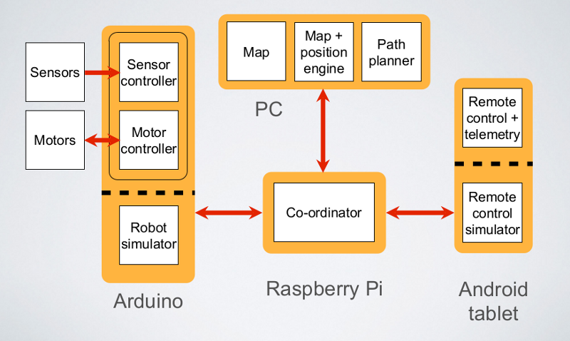
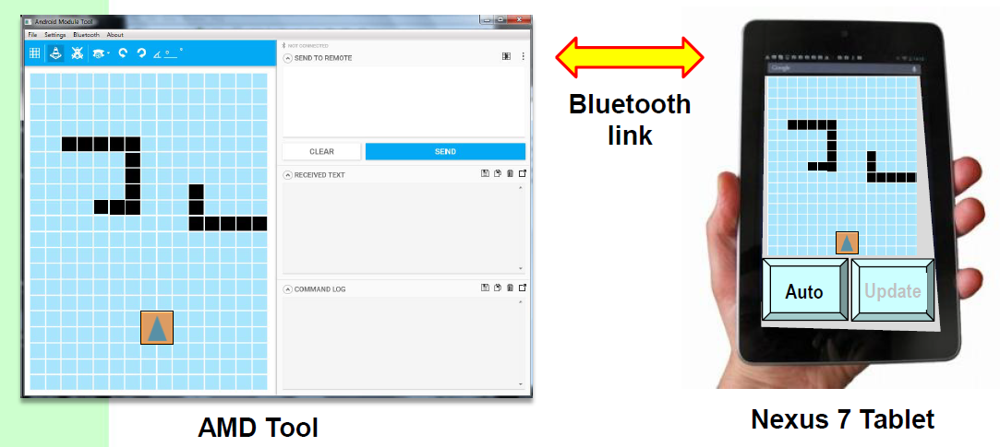

## Project Overview

This repository contains an Android Remote Control application developed as part of a larger robotics project involving a robot navigating a maze. 
The Android application serves as a wireless Bluetooth interface for the robotic system. 
It allows a user to control the robot’s movement, monitor its status, and visualize the robot’s position and environment using a 2D grid-based map. 
The application communicates with an external robotic module (e.g. Raspberry Pi / AMD tool) via Bluetooth.

  
  

## Project Scope

Within the scope of this project, the Android application is responsible for:
- Acting as a Bluetooth remote control for the robot
- Sending string-based commands to control robot movement
- Receiving status and coordinate updates over a Bluetooth serial link
- Rendering the maze environment and robot position on the UI
- Supporting persistent, user-configurable command strings

## Core Features

### 1. Bluetooth Serial Communication
Transmits and receives text-based messages over a Bluetooth serial link to communicate with the robotic module.

### 2. Bluetooth Device Discovery & Connection
Provides a graphical interface for scanning, selecting, and connecting to nearby Bluetooth devices.

### 3. GUI-Based Robot Movement Control
Enables interactive control of robot movement using GUI elements such as buttons, which send predefined commands over Bluetooth.

### 4. Robot Status Display
Displays the current robot state (e.g. stopped, moving) using selective status information on the user interface.

### 5. Touch-Based Waypoint & Start Coordinate Selection
Allows robot start coordinates and waypoints to be selected through touch interaction on the grid-based map and transmitted over Bluetooth.

### 6. 2D Grid-Based Maze Visualization
Renders a 2D grid map showing obstacles, the robot’s position, and its heading.

### 7. Manual & Automatic Grid Updates
Supports both user-triggered manual updates and automatic background updates of the maze visualization based on received state changes.

### 8. Persistent User-Configurable Commands
Allows users to configure predefined command strings via the UI, which are stored persistently and retained across application restarts.

### 9. Robust Bluetooth Connectivity Handling
Handles temporary Bluetooth disconnections gracefully and resumes communication when the connection is re-established.

### 10. Arrow Block Rendering on Grid Map
Updates the grid map by replacing obstacle cells with arrow blocks when coordinate-based commands are received.

## Lessons Learnt
- Practical Android application development using Activities, Fragments, and Services
- Integration with Android Bluetooth API for device discovery, connection management, and data exchange
- Event-driven UI updates using Handlers and listeners to react to external state changes
- Custom UI rendering with GridView adapters for dynamic, state-based visualization
- Touch-based user interaction for spatial input within a custom grid interface
- Use of persistent storage to retain user-configurable command strings across app restarts
- Defensive handling of intermittent connectivity without blocking or crashing the UI
